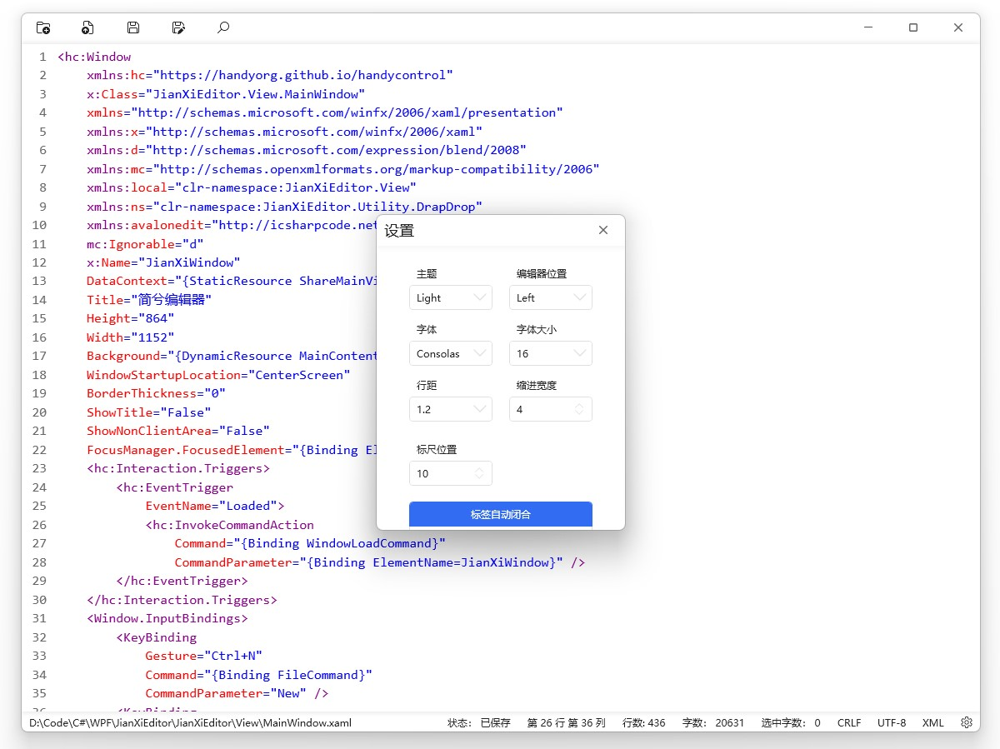
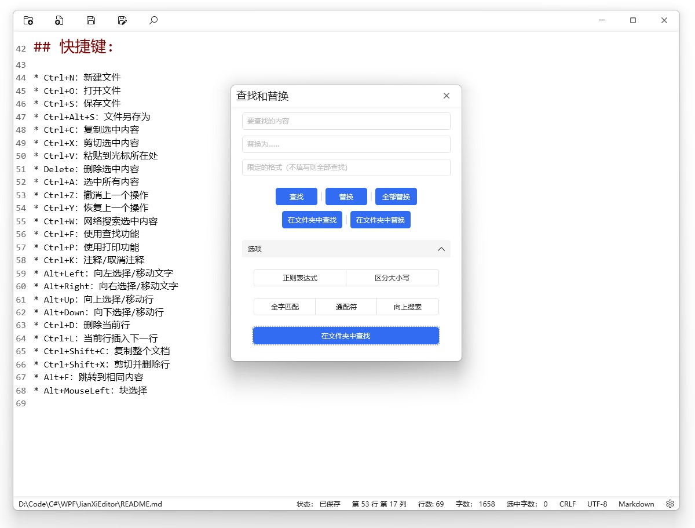
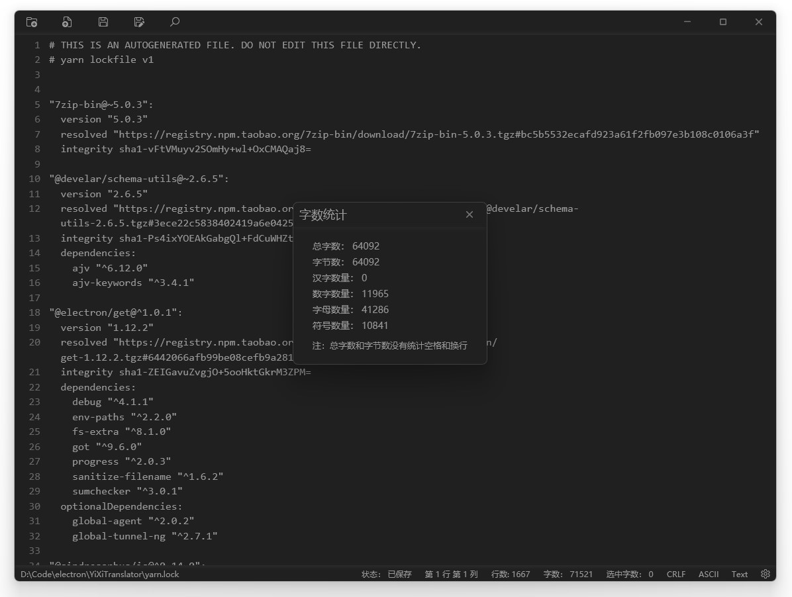

  

<h1 align="center">
  简兮编辑器
</h1>

  WPF开发的代码编辑器。

  
  
  

## 功能特色
* 漂亮的界面
* 浅色和深色主题
* 行号显示
* 语法高亮
* 切换编码格式
* 详细的字数统计
* 快速选择/移动文字
* 快速选择/移动行
* 高亮显示相同内容
* 标签自动闭合
* 文件自动保存
* 历史打开文件
* ……

## 软件截图:

## 快捷键:

* Ctrl+N：新建文件
* Ctrl+O：打开文件
* Ctrl+S：保存文件
* Ctrl+Alt+S：文件另存为
* Ctrl+C：复制选中内容
* Ctrl+X：剪切选中内容
* Ctrl+V：粘贴到光标所在处
* Delete：删除选中内容
* Ctrl+A：选中所有内容
* Ctrl+Z：撤消上一个操作
* Ctrl+Y：恢复上一个操作
* Ctrl+W：网络搜索选中内容
* Ctrl+F：使用查找功能
* Ctrl+P：使用打印功能
* Ctrl+K：注释/取消注释
* Alt+Left：向左选择/移动文字 
* Alt+Right：向右选择/移动文字
* Alt+Up：向上选择/移动行
* Alt+Down：向下选择/移动行
* Ctrl+D：删除当前行
* Ctrl+L：当前行插入下一行
* Ctrl+Shift+C：复制整个文档
* Ctrl+Shift+X：剪切并删除行
* Alt+F：跳转到相同内容
* Alt+MouseLeft：块选择
